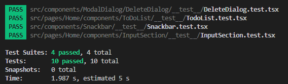
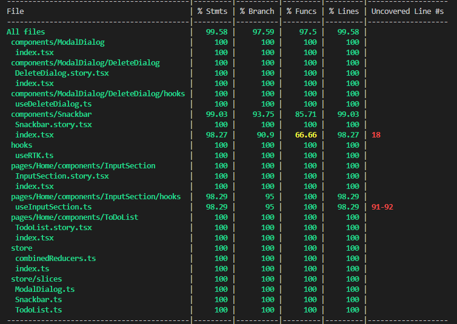
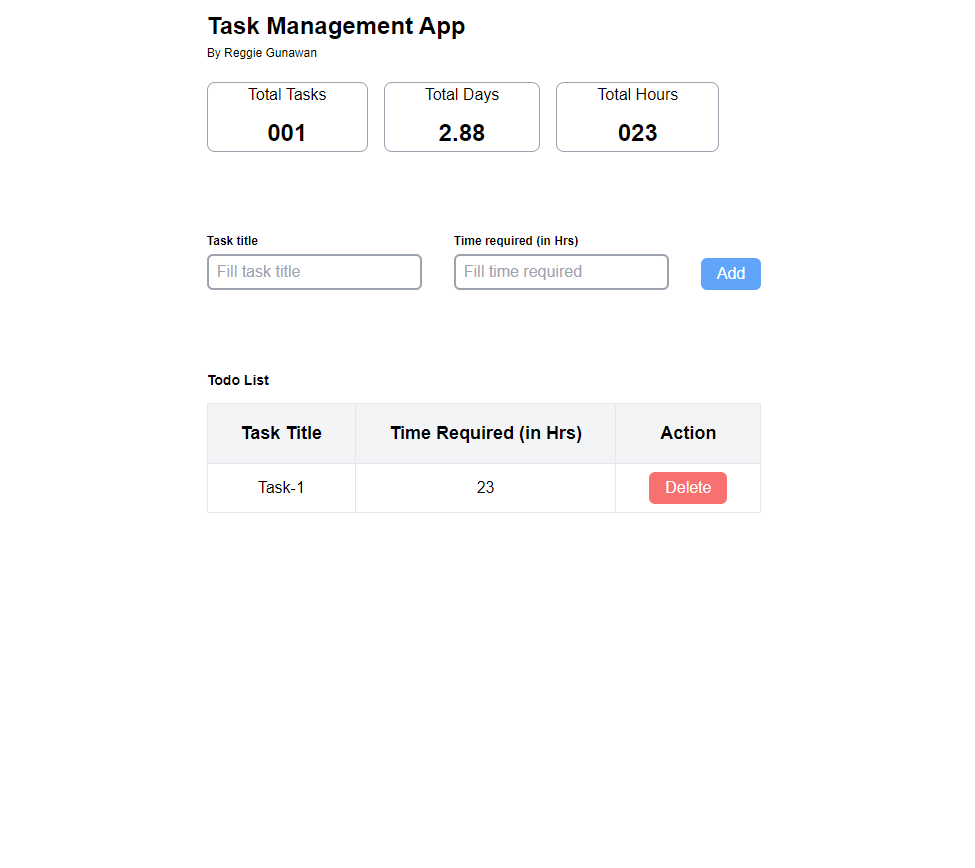

# Task Management App

Task Management App is aimed to simplify the lives of individuals and teams by providing a seamless and intuitive platform to manage their daily tasks. With a strong focus on user experience, the team set out to build a user-friendly UI that would revolutionize the way people organized their work.

### Development

Stacks:

- Next JS (https://nextjs.org)
- React JS v18 (https://react.dev/)
- TypeScript (https://www.typescriptlang.org)
- Tailwind CSS (https://tailwindcss.com)
- Redux Toolkit (https://redux-toolkit.js.org/)

### Requirements

- Node.js 14+ and npm

### Getting started

Run the following command on your local environment:

```
1. Copy and paste the ZIP files to the target directory git clone
2. Redirect to your project directory (cd my-project-directory from your code editor)
3. npm i / npm install
```

Then, you can run locally in development mode with live reload:

```
npm run dev
```

(Optional) To run unit tests, you can run locally with:

```
npm run test
```

Open http://localhost:3000 with your favorite browser to see and enjoy the project.

### Test Coverage

#### Test files



#### Code coverage



### VSCode information (optional)

If you are VSCode users, you can have a better integration with VSCode by installing the suggested extension in `.vscode/extension.json`.

### Screenshot

#### Homepage



### License

Licensed under the MIT License, Copyright © 2022
